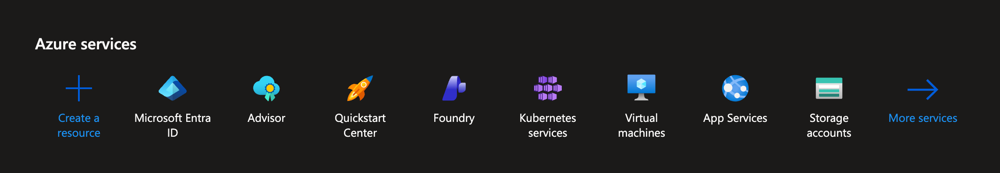
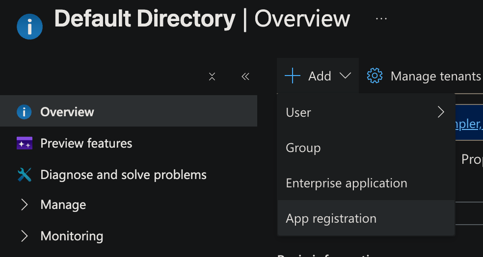
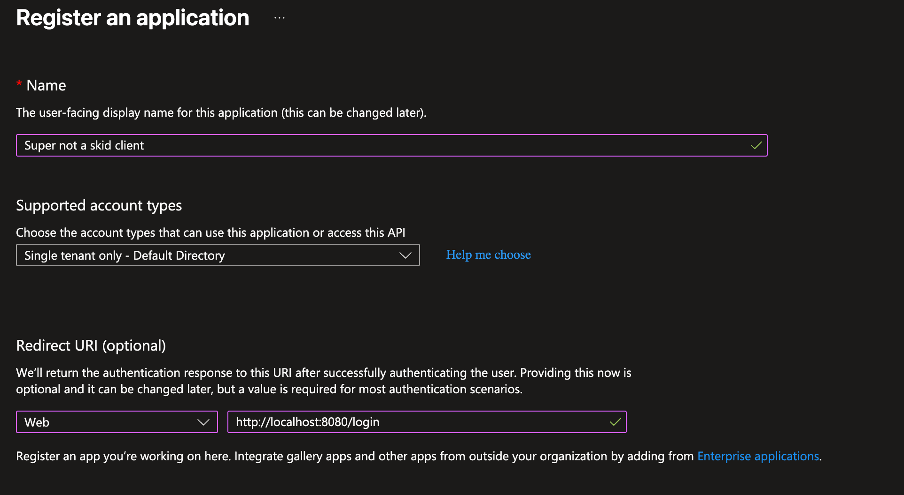
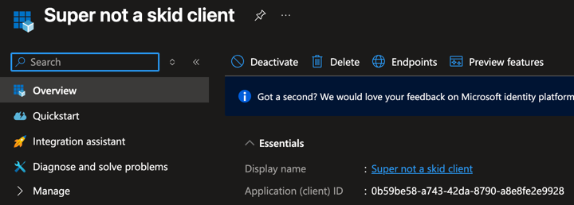
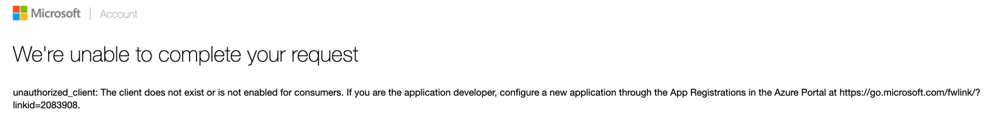

# MSA Auth

A simple project compatible with Java 8 to authenticate an email & password via Microsoft and Xbox Live to log into a Minecraft account

---

## Usage

`us.xgraza.msa_auth.MSAAuth` - The class to use (all static)

There are three ways provided to log into a Microsoft account: email & password, browser login (OAuth2), and an access token

---

### Email & Password

If you have an email and password, you are able to login with that:

```java
final MinecraftProfile profile = MSAAuth.getProfile(email, password);
// log in with a session etc.
```
---

### Browser login

If you are using the browser login method (OAuth2), you will need to first create an Azure project if you have not already.

To create an Azure application, follow these instructions:
1. Go to https://portal.azure.com/#home and login into your Microsoft account (or create one)
2. Press `Microsoft Entra ID` 
3. Press `+ Add` > `App Registration` 
4. Type in a Name, keep the Supported account types under Single tenant only, then select "Web" in the dropdown under Redirect URI, then type in your redirect URI (as shown) 
5. Press the blue `Register` button to create your application
6. After the application was created, you should see a screen similar to the picture below. The one that says `Application (client) ID` is the client id you will use. 

After you have the client id, port, and redirect URL set up correctly in Azure, add this to your code before you do a browser login:

```java
MSAAuth.setCallbackPort(PORT); // change PORT to the port you put on the Azure application
MSAAuth.setClientID("your_azure_client_id");
```

Once you have done this, you are now able to log into via the browser:

```java
final String oauthURL = MSAAuth.loginWithBrowser((oauthToken) ->
{
    // If the oauthToken passed via the callback is null/empty, something went wrong
   if (oauthToken == null || oauthToken.isEmpty())
   {
       throw new RuntimeException("OAuth2 token was invalid!");
   }
    // To get the Minecraft profile, you must log in with the OAuth2 code:
    // the boolean at the second parameter should ALWAYS be true if you are using a browser
   final MinecraftProfile profile = MSAAuth.getProfileFromOAuth2(oauthToken, true);
    // log in via a session etc.
});
```

In the above example, you will give the user logging into an account the value of `oauthURL`

### Access token

If you have an access token, you are able to log in with just that

```java
// boolean at the second parameter should be false - we are not logging in via a browser
final MinecraftProfile profile = MSAAuth.getProfile(accessToken, false);
```

---

## Common errors

If you are using the browser login (OAuth2) and you click the URL and it shows this:



You have either not set the Client ID & port on the MSAAuth object, or you have misconfigured the Azure application